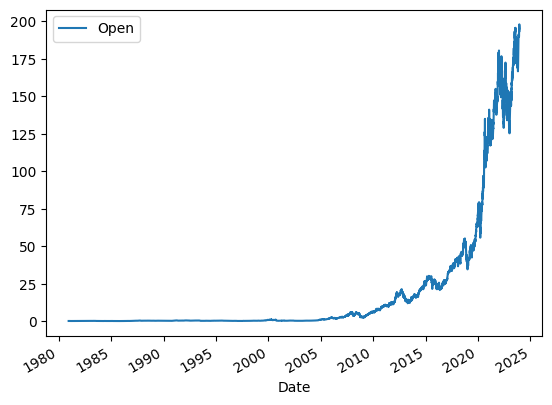
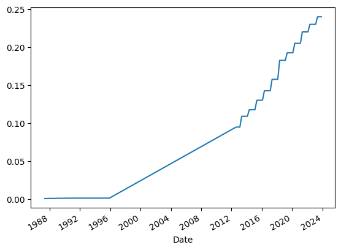
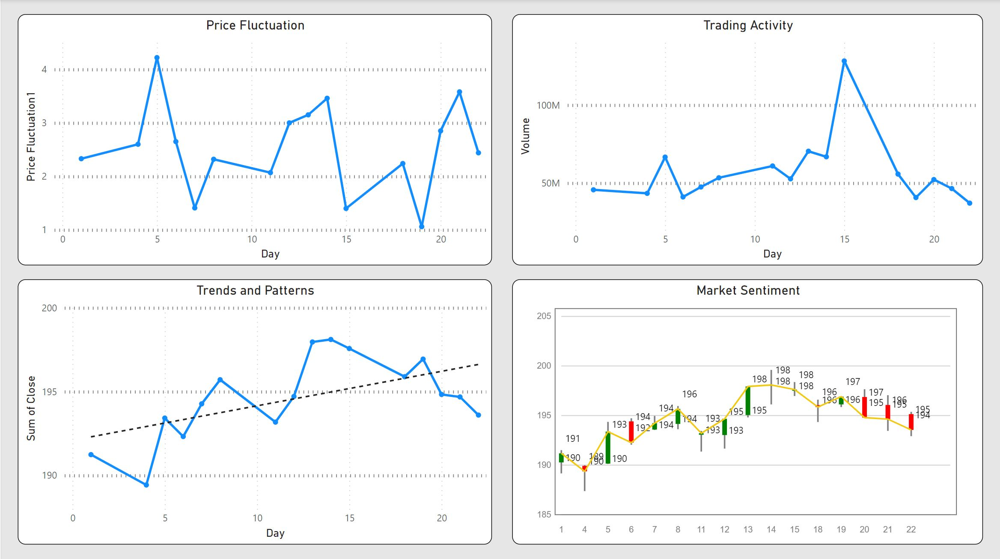

# Stock-Data-Analysis-with-Python-Power-BI

### Overview
This project focuses on leveraging Python to extract and analyze stock data using the yfinance library and Microsoft Power BI.

### Project Description
This lab utilizes the yfinance Python library, enabling the extraction of stock data conveniently. The library facilitates the retrieval of stock-related information and returns the data in the form of a Pandas DataFrame, allowing for efficient data manipulation and analysis.

### Objectives
- Extract stock data using the yfinance library.
- Utilize Pandas DataFrames to perform analysis on the extracted stock data.
- Exporting the data frame as a CSV file for data transformation in Microsoft Excel and Visualization in Microsoft Power BI.

### Technologies Used
- Python
- yfinance library
- Pandas
- Microsoft Excel
- Microsoft Power BI

### Analysis

Preliminary analysis was done on Python after extracting the dataset. The dataset then underwent a further transformation in Microsoft Excel. During this phase, The Date (DD/MM/YYYY) was extracted from the Date column using the LEFT function in Excel before exporting it to Microsoft Power BI for comprehensive data profiling and visualization. The Analysis focuses on the stock performance for December 2023 (1/12/2023 - 22/12/2023).

Python-based visuals:

| Open price against the Date |     Dividends overtime      |
|-----------------------------|-----------------------------|
|  |  | 

Subsequently, in-depth data profiling and analysis were carried out using Microsoft Power BI to uncover further insights from the dataset. Custom visualization was employed within Power BI utilizing the Microsoft Appsource .

Microsoft Power BI custom visuals:

### Insights
